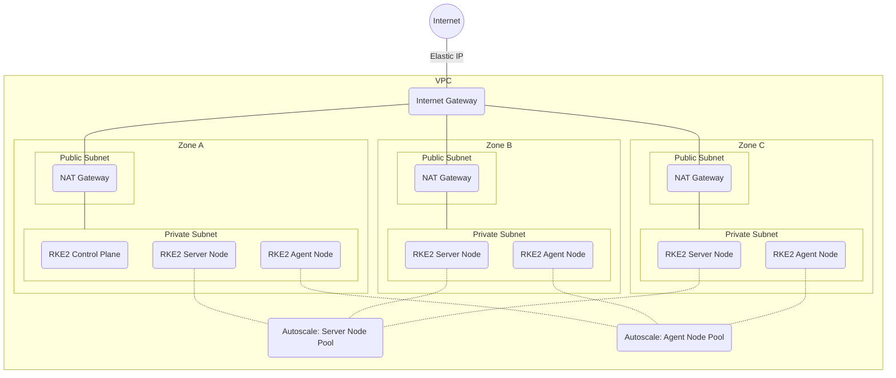

# Big Bang Infrastructure as Code (IaC)

The terraform/terragrunt code in this directory will setup the infrastructure for a Big Bang deployment in Amazon Web Services (AWS).  It starts from scratch with a new VPC and finishes by deploying a multi-node [RKE2 Cluster](https://docs.rke2.io/).  The cluster can then be used to deploy Big Bang.

> This code is intended to be a starting point / example for users to get their infrastructure setup quickly.  It is up to the users to futher customize the code for the intended use.

## Layout

The following directory tree shows the layout of the the configuration files in this repository.  Users should be able to customize the most common items by adjusting values in the `.yaml` files.  Additional regions and/or environment directories can be created to maintain multiple deployments without changing the main terraform code.

```text
terraform
└── main                # Shared terraform code
└── us-gov-west-1       # Terragrunt code for a specific AWS region
    ├── region.yaml     # Regional configuration
    └── prod            # Teragrunt code for a specific environment (e.g. prod, stage, dev)
        └── env.yaml    # Environment specific configuration
```

## Prerequisites

- An AWS cloud account with admin privileges
- [Terraform](https://www.terraform.io/downloads.html)
- [Terragrunt](https://terragrunt.gruntwork.io/docs/getting-started/install/)
- [AWS CLI](https://docs.aws.amazon.com/cli/latest/userguide/install-cliv2.html)
- [Kubectl](https://kubernetes.io/docs/tasks/tools/#kubectl)

## Quickstart

- Review the configuration
  - Review [region.yaml](./us-gov-west-1/region.yaml).  Update your deployment region if necessary.
  - Review [env.yaml](./us-gov-west-1/prod/env.yaml).  At a minimum, update `name` to identify your deployment.

- Validate your configuration

    ```bash
    cd ./terraform/us-gov-west-1/prod
    terragrunt run-all validate
    # Successful output: Success! The configuration is valid.
    ```

- Run the deployment

    ```bash
    terragrunt run-all apply
    ```

- Connect to cluster

    ```bash
    TBD
    ```

- Shell into nodes

    ```bash
    TBD
    ```

## Infrastructure Manifest



## Flow

1. Creates SSH Key Pair
1. Add VPC
1. Add EIP NAT
1. Add internet gateway
1. Add route tables
1. Create subnets
1. Add Security groups for Endpoints
1. Add NAT Gateway (public)
1. Add NAT Gateway (private)
1. Create random password token (stored in S3)
1. Create security grouips and rules
1. Create S3 bucket for storage
1. Create IAM role/profile
1. Create autoscaling group

## Additional Resources

- [Rancher Kubernetes Engine Government (RKE2) Docs](https://docs.rke2.io/)
- [RKE2 AWS Terraform Docs](https://github.com/rancherfederal/rke2-aws-tf)


```
# update varibles.tf 
terraform init
terraform apply
export KUBECONFIG="$PWD"/rke2.yaml
```
Kubeconfig is dumped into working directory as `rke2.yaml`


### EBS Storage Class is installed by default.

For Local-Path Storage
```
kubectl patch storageclass ebs -p '{"metadata": {"annotations":{"storageclass.kubernetes.io/is-default-class":"false"}}}'
kubectl apply -f https://raw.githubusercontent.com/rancher/local-path-provisioner/master/deploy/local-path-storage.yaml
kubectl patch storageclass local-path -p '{"metadata": {"annotations":{"storageclass.kubernetes.io/is-default-class":"true"}}}'
```
For Longhorn
```
kubectl patch storageclass ebs -p '{"metadata": {"annotations":{"storageclass.kubernetes.io/is-default-class":"false"}}}'
kubectl apply -f https://raw.githubusercontent.com/longhorn/longhorn/v1.1.0/deploy/longhorn.yaml
kubectl patch storageclass longhorn -p '{"metadata": {"annotations":{"storageclass.kubernetes.io/is-default-class":"true"}}}'
```