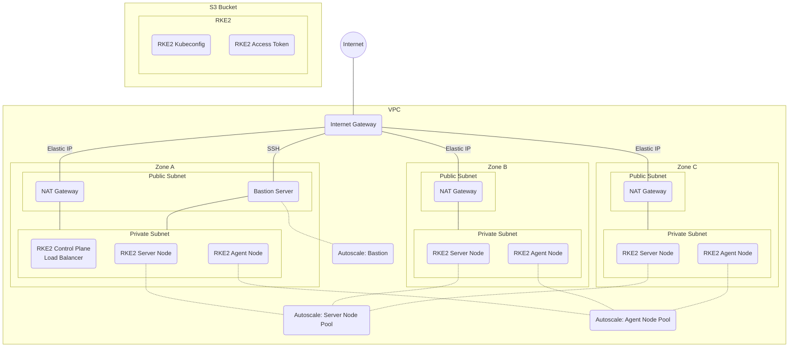

# Big Bang Infrastructure as Code (IaC)

The terraform/terragrunt code in this directory will setup the infrastructure for a Big Bang deployment in Amazon Web Services (AWS).  It starts from scratch with a new VPC and finishes by deploying a multi-node [RKE2 Cluster](https://docs.rke2.io/).  The cluster can then be used to deploy Big Bang.

> This code is intended to be a starting point / example for users to get their infrastructure setup quickly.  It is up to the users to futher customize the code for the intended use.

## Layout

The following directory tree shows the layout of the the configuration files in this repository.  Users should be able to customize the most common items by adjusting values in the `.yaml` files.  Additional regions and/or environment directories can be created to maintain multiple deployments without changing the main terraform code.

```text
terraform
└── main                # Shared terraform code
└── us-gov-west-1       # Terragrunt code for a specific AWS region
    ├── region.yaml     # Regional configuration
    └── prod            # Teragrunt code for a specific environment (e.g. prod, stage, dev)
        └── env.yaml    # Environment specific configuration
```

## Prerequisites

- An AWS cloud account with admin privileges
- [Terraform](https://www.terraform.io/downloads.html)
- [Terragrunt](https://terragrunt.gruntwork.io/docs/getting-started/install/)
- [AWS CLI](https://docs.aws.amazon.com/cli/latest/userguide/install-cliv2.html)
- [Kubectl](https://kubernetes.io/docs/tasks/tools/#kubectl)

## Quickstart

- Review the configuration
  - Review [region.yaml](./us-gov-west-1/region.yaml).  Update your deployment region if necessary.
  - Review [env.yaml](./us-gov-west-1/prod/env.yaml).  At a minimum, update `name` to identify your deployment.

- Validate your configuration

    ```bash
    cd ./terraform/us-gov-west-1/prod
    terragrunt run-all validate
    # Successful output: Success! The configuration is valid.
    ```

- Run the deployment

    ```bash
    # Pre-check
    terragrunt run-all plan

    # Deploy
    terragrunt run-all apply
    ```

- Connect to cluster

    ```bash
    # Setup your cluster name (same as `name` in `env.yaml`)
    export CNAME="bigbang-dev"

    # Get Bastion Security Group ID
    export BSG=`aws ec2 describe-instances --filters "Name=tag:Name,Values=$CNAME-bastion" --query 'Reservations[*].Instances[*].SecurityGroups[*].GroupId' --output text`

    # Get your public IP address
    export MYIP=`curl -s http://checkip.amazonaws.com/`

    # Add SSH ingress for your IP to the bastion security group
    aws ec2 authorize-security-group-ingress --group-id $BSG --protocol tcp --port 22 --cidr $MYIP/32

    # Get Bastion public IP address
    export BIP=`aws ec2 describe-instances --filters "Name=tag:Name,Values=$CNAME-bastion" --query 'Reservations[*].Instances[*].PublicIpAddress' --output text`

    # Use sshuttle to tunnel traffic through bastion public IP
    # You can add the '-D' option to sshuttle to run this as a daemon.
    # Otherwise, you will need another terminal to continue.
    sshuttle --dns -vr ec2-user@$BIP 10.0.0.0/8 --ssh-cmd "ssh -i ~/.ssh/$CNAME.pem"

    # Validate connectivity
    kubectl get no
    ```

## RKE2 Storage

In order for Big Bang to deploy properly, it must have a default storage class.  The following will install a storage class for [AWS EBS](https://docs.aws.amazon.com/AWSEC2/latest/UserGuide/AmazonEBS.html).

```bash
kubectl apply -f ./terraform/storageclass/ebs-gp2-storage-class.yaml
```

If you have an alternative storage class, you can run the following to replace the EBS GP2 one provided.

```bash
kubectl patch storageclass ebs -p '{"metadata": {"annotations":{"storageclass.kubernetes.io/is-default-class":"false"}}}'
kubectl apply -f <path to your storage class.yaml>
# For example...
# Local-path: https://raw.githubusercontent.com/rancher/local-path-provisioner/master/deploy/local-path-storage.yaml
# Longhorn: https://raw.githubusercontent.com/longhorn/longhorn/v1.1.0/deploy/longhorn.yaml
kubectl patch storageclass <name of your storage class> -p '{"metadata": {"annotations":{"storageclass.kubernetes.io/is-default-class":"true"}}}'
```

At this point, you can deploy Big Bang according to the product documentation.

## Infrastructure

### Manifest

Once the terraform has run, you will have the following resources deployed:

- [Virtual Private Cloud (VPC)](https://aws.amazon.com/vpc/?vpc-blogs.sort-by=item.additionalFields.createdDate&vpc-blogs.sort-order=desc)
- [Internet Gateway](https://docs.aws.amazon.com/vpc/latest/userguide/VPC_Internet_Gateway.html)
- Public subnets
  - One for each [availability zone](https://docs.aws.amazon.com/AWSEC2/latest/UserGuide/using-regions-availability-zones.html)
  - VPC CIDR traffic routed locally
  - Connected to Internet
- Private subnets
  - One for each [availability zone](https://docs.aws.amazon.com/AWSEC2/latest/UserGuide/using-regions-availability-zones.html)
  - VPC CIDR traffic routed locally
  - Other traffic routed to [NAT Gateway](https://docs.aws.amazon.com/vpc/latest/userguide/vpc-nat-gateway.html)
- NAT Gateway
  - [Elastic IP](https://docs.aws.amazon.com/AWSEC2/latest/UserGuide/elastic-ip-addresses-eip.html) assigned for internet access
  - Prevents internet ingress to private subnet
  - Allows internet egress from private subnet
- [RKE2](https://docs.rke2.io/) Kubernetes Cluster
  - RKE2 Control Plane
  - RKE2 Servers
    - Autoscaled node pool
    - Anti-affinity
  - RKE2 Agents (Generic)
    - Autoscaled node pool
    - Anti-affinity
  - Security Groups
    - Egress not restricted
    - Internal cluster ingress allowed
    - Control Plane traffic limited to port 6443 and 9345 to servers
  - SSH keys created and stored on all nodes.  Private key is stored locally in `~/.ssh`
- [CoreDNS](https://coredns.io/)
- [Metrics Server](https://github.com/kubernetes-sigs/metrics-server)
- Bastion
  - Autoscale group insures one bastion is available
  - Security group allows SSH on Whitelist IP
  - Cluster setup to allow SSH from Bastion
- S3 Storage Bucket
  - RKE2 Kubeconfig for accessing cluster
  - RKE2 access token for adding additional nodes

### Diagram



## Debug

After Big Bang deployment, if you wish to access your deployed web applications that are not exposed publically, add an entry into your /etc/hosts to point the host name to the internal load balancer created by Istio in Big Bang.  This requires that you maintain a sshuttle tunnel to the bastion server, but gives you DNS capabilities for applications.

The following example sets up a DNS route for `*.bigbang.dev` to the internal load balancer created by Big Bang.

```bash
# Setup cluster name from env.yaml
export CName="bigbang-dev"

# Get VPC info
export VPCId=`aws ec2 describe-vpcs --filters "Name=tag:Name,Values=$CName" --query 'Vpcs[*].VpcId' --output text`

# Get load balancer in VPC that does not contain cluster name
# Istio in Big Bang creates a load balancer
export LBDNS=`aws elb describe-load-balancers --query "LoadBalancerDescriptions[? VPCId == '$VPCId' && "'!'"contains(LoadBalancerName, '$CName')].DNSName" --output text`

# Retrieve IP address of load balancer for /etc/hosts
dig $LBDNS +short | head -1

# Now add the hostname of the web appliation into /etc/hosts
# You may need to log out and back into for hosts to take effect
sudo vi /etc/hosts  # <IP of load balancer> <host name>
```

## Optional Terraform

Depending on your needs, you may want to deploy additional infrastructure, such as Key Stores, S3 Buckets, or Databases, that can be used with your deployment.  In the [options](./options) directory, you will find terraform / terragrunt snippits that can assist you in deploying these items.

## Additional Resources

- [Rancher Kubernetes Engine Government (RKE2) Docs](https://docs.rke2.io/)
- [RKE2 AWS Terraform Docs](https://github.com/rancherfederal/rke2-aws-tf)
